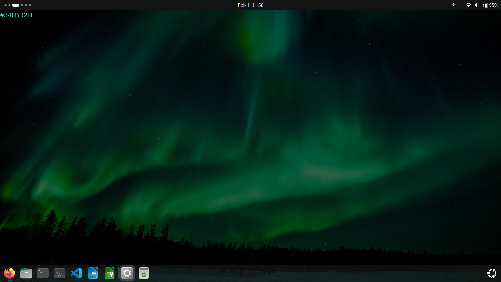
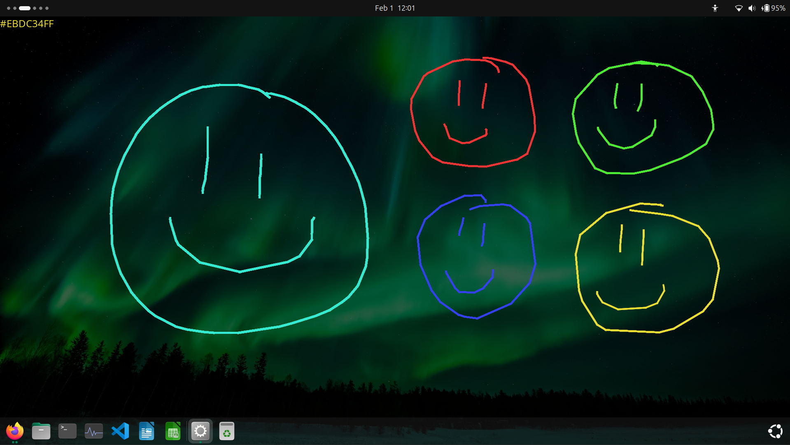
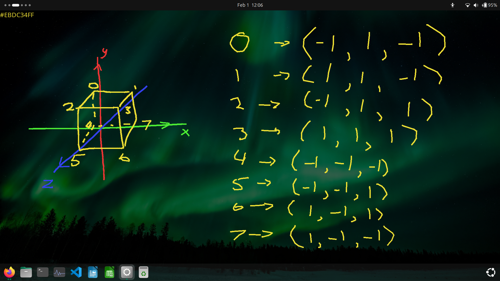
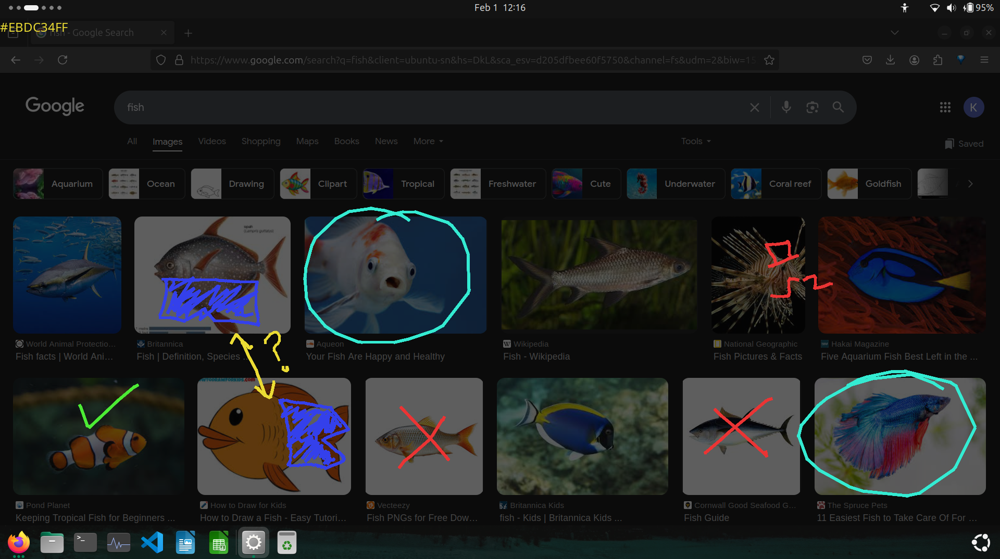

# Glass

Glass is a simple overlay program used to draw on your screen.

When you run glass your screen will dim and you will see a colour code in the top left corner



Now you are free to draw all over your screen and you can use the number keys to switch colour at anytime!



You can undo a stroke by hitting ctrl+z like usual and you can close the program by hitting escape!

The main reason I made Glass is for those moments that you need to work something out but you don't have paper around.



Glass will also appear on top of any window that you have open making it great for illustrating over it to explain it to someone or further your own understanding.



## Settings file

When run, Glass will generate a default settings file that looks like this

```
key:49:#ACACAC
key:50:#FF0000
key:51:#00FF00
key:52:#0000FF
```

This shows you what keys are mapped to what colour, *key:49* is the 1 key and *#ACACAC* is the colour that key would be mapped to.
To change the colours that glass can use simply update the file with new colour codes and keys.

A list of the numbers relating to keys can be found [Here](https://docs.oracle.com/javase/8/docs/api/constant-values.html#java.awt.event.KeyEvent.CHAR_UNDEFINED)

A place to generate the hex codes can be found [Here](https://htmlcolorcodes.com/)


*For the best experience using glass, compile the java and then set a hotkey to run the compiled program in whatever operating system you are on.*
